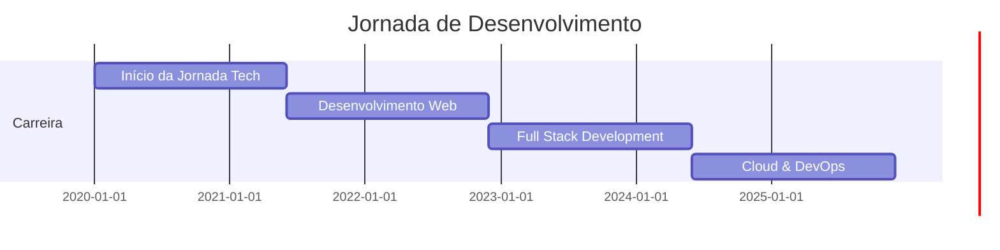

<div align="center">
  
</div>

<div align="center">

  [](https://git.io/typing-svg)

</div>

---


### 👨‍💻 Sobre Mim

```typescript
const yuri = {
  nome: "Yuri Ferreira",
  localização: "Ribeirão Preto - SP 🇧🇷",
  role: "Full Stack Developer",
  código: ["JavaScript", "TypeScript", "Python", "C#"],
  tecnologias: {
    frontend: ["React", "HTML5", "CSS3", "Tailwind"],
    backend: ["Node.js", "Python", "C#"],
    databases: ["PostgreSQL", "MongoDB", "AWS Athena"],
    devOps: ["Docker", "Git", "Node-RED"],
    tools: ["Metabase", "VS Code", "Postman"]
  },
  missão: "Criar soluções que inspirem e transformem! 🚀",
  focoAtual: "Desenvolvimento de aplicações escaláveis",
  hobby: "Aprender novas tecnologias e contribuir com a comunidade"
};
```

<br clear="right"/>

---

### 🏆 Conquistas GitHub

<div align="center">
  
</div>

---

### 📊 Estatísticas & Métricas

<div align="center">
  
  
</div>

<div align="center">
  
  
</div>

---

### 💻 Stack Tecnológica

<div align="center">

#### **Frontend Development**


#### **Backend Development**


#### **Databases & Cloud**


#### **DevOps & Tools**


</div>

---

### 🎯 Áreas de Expertise

<div align="center">

| 💼 Categoria | 🛠️ Tecnologias | 📈 Nível |
|-------------|----------------|----------|
| **Frontend** | React, TypeScript, HTML/CSS | ⭐⭐⭐⭐⭐ |
| **Backend** | Node.js, Python, C# | ⭐⭐⭐⭐⭐ |
| **Database** | PostgreSQL, MongoDB | ⭐⭐⭐⭐ |
| **DevOps** | Docker, Git, CI/CD | ⭐⭐⭐⭐ |
| **Cloud** | AWS (Athena, S3, EC2) | ⭐⭐⭐ |
| **Data Viz** | Metabase, Dashboards | ⭐⭐⭐⭐ |

</div>

---

### 🚀 Projetos em Destaque

<div align="center">

<a href="https://github.com/yurialvesferreira/portfolio">
  
</a>

<a href="https://github.com/yurialvesferreira/dashboard">
  
</a>

</div>

<div align="center">
  <br>

  **📌 Portfólio Pessoal**: Site moderno com foco em UI/UX e experiência do usuário

  **📊 Dashboard Analytics**: Ferramenta avançada de visualização e análise de dados

</div>

---

### 📈 Linha do Tempo Profissional



---

### 🎓 Conhecimentos & Certificações

<div align="center">

| 🏅 Área | 📚 Conhecimento | 🎖️ Status |
|---------|----------------|-----------|
| **Web Development** | React + TypeScript | ✅ Avançado |
| **Backend APIs** | RESTful, Node.js | ✅ Avançado |
| **Database Design** | SQL & NoSQL | ✅ Intermediário |
| **Cloud Computing** | AWS Services | ✅ Intermediário |
| **Container Tech** | Docker | ✅ Intermediário |
| **Version Control** | Git & GitHub | ✅ Avançado |

</div>

---

### 📫 Conecte-se Comigo

<div align="center">

  [](https://www.linkedin.com/in/yaferreira)
  [](https://instagram.com/_yurialvesferreira)
  [](mailto:yuri.sistemas@outlook.com)
  [](https://github.com/yurialvesferreira)

</div>

---

### 🐍 Contribuições

<div align="center">
  
</div>

---

### 📊 Métricas Detalhadas

<div align="center">

  

  
  

  
  

</div>

---

### 💡 Frase Motivacional

<div align="center">

  

</div>

---

### 👀 Visitantes do Perfil

<div align="center">

  

  

</div>

---

<div align="center">

  ### 💬 "Código limpo não é escrito seguindo regras. Você sabe que escreveu código limpo quando cada função faz exatamente o que você espera que ela faça." - Ward Cunningham

  ⭐️ **Se você gostou do meu perfil, deixe uma estrela nos meus projetos!** ⭐️

  

</div>
